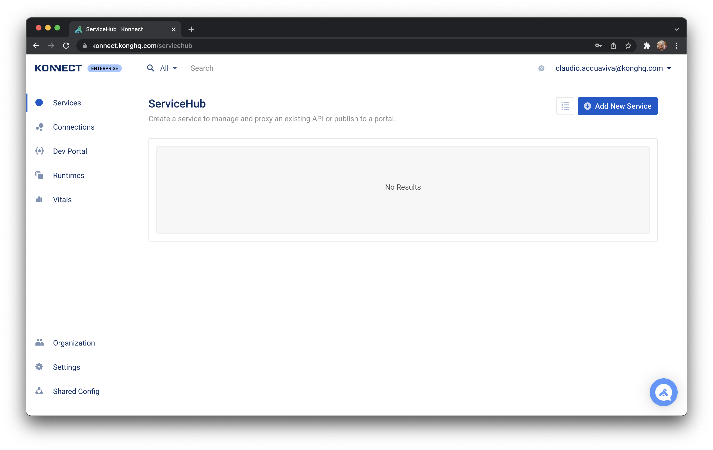

# Exposing and Controlling Kafka Event Streaming with Kong Konnect and Confluent Cloud


## Kong Konnect and Confluent Cloud Reference Architecture

Event streaming allows companies to build more scalable and loosely coupled real-time applications supporting massive concurrency demands and simplifying the construction of services.

At the same time, API management provides capabilities to securely control the upstream services consumption, including the event processing infrastructure.

Kong Konnect can complement Kafka Event Streaming, exposing it to new and external consumers while applying specific and critical policies to control its consumption, including API key, OAuth/OIDC and others for authentication, rate limiting, caching, log processing, etc.


The diagram considers that the Kafka Platform is not being exposed to external applications or services. In this sense the Gateway is responsible not just to expose your Kafka Platform but, more importantly, to control such exposure with typical policies like Authentication, Rate Limiting, etc.

In an architecture like this, Kong will translate a regular REST request into Kafka messages to be posted in existing topics.

The diagram also shows that Kong Konnect has been deployed on a Hybrid environment, with a total separation of the Control Plane (CP) and Data Plane (DP). That is, while the Control Plane, managed by Kong, is responsible for administration tasks, the Data Plane is exclusively used by API Consumers. The Data Plane can be running on a variety of platforms including Docker, Kubernetes, VMs, etc.


## 


## Kafka Cluster


### Create the Kafka Cluster

Login to [http://confluent.cloud](http://confluent.cloud) and create a basic Cluster.


### Install Confluent Cloud CLI

Install the Confluent Cloud CLI locally with the following command


```
curl -sL --http1.1 https://cnfl.io/cli | sh -s -- latest
```


Check the installation with:


```
$ ./confluent version
confluent - Confluent CLI

Version:     v2.3.1
Git Ref:     bc90de55
Build Date:  2021-12-10T21:02:09Z
Go Version:  go1.16.3 (darwin/amd64)
Development: false
```


### Checking the Kafka Environment

Now you can login to Confluent Cloud and check your environment.


```
$ ./confluent login --prompt
Enter your Confluent Cloud credentials:
Email: claudio.acquaviva@konghq.com
Password: ********

$ ./confluent env list
      ID      |  Name    
--------------+----------
  * env-99999 | default  

$ ./confluent kafka cluster list
      Id      |   Name    | Type  | Provider |  Region   | Availability | Status  
--------------+-----------+-------+----------+-----------+--------------+---------
    xxx-99x99 | cluster_0 | BASIC | aws      | us-east-2 | single-zone  | UP      

$ ./confluent kafka cluster describe lkc-90x20
+--------------+---------------------------------------------------------+
| Id           | xxx-99x99                                               |
| Name         | cluster_0                                               |
| Type         | BASIC                                                   |
| Ingress      |                                                     100 |
| Egress       |                                                     100 |
| Storage      |                                                    5000 |
| Provider     | aws                                                     |
| Availability | single-zone                                             |
| Region       | us-east-2                                               |
| Status       | UP                                                      |
| Endpoint     | SASL_SSL://xxx-yyyyy.us-east-2.aws.confluent.cloud:9092 |
| RestEndpoint | https://xxx-yyyyy.us-east-2.aws.confluent.cloud:443     |
+--------------+---------------------------------------------------------+

$ ./confluent kafka cluster use xxx-99x99
Set Kafka cluster "xxx-99x99" as the active cluster for environment "env-99999".
```


### Create a Kafka topic

Create a Kafka topic. The Kong Kafka Upstream plugin will be configured to post new events to it.


```
$ ./confluent kafka topic create topictest --partitions 1
Created topic "topictest".

$ ./confluent kafka topic list
    Name     
-------------
  topictest  
```


### Create an API Key to access the topic


```
$ ./confluent api-key create --resource xxx-99x99
It may take a couple of minutes for the API key to be ready.
Save the API key and secret. The secret is not retrievable later.
+---------+------------------------------------------------------------------+
| API Key | <APIKEY>                                                 |
| Secret  | <SECRET> |
+---------+------------------------------------------------------------------+

$ ./confluent api-key use <APIKEY> --resource xxx-99x99
Set API Key "<APIKEY>" as the active API key for "xxx-99x99".
```


If you want to delete the topic run:


```
./confluent kafka topic delete topictest --partitions 1
```


### Test the Kafka topic

On one local terminal start the Kafka consumer:


```
$ ./confluent kafka topic consume -b topictest
Starting Kafka Consumer. Use Ctrl-C to exit.
```


Open another terminal to run the Kafka producer


```
$ ./confluent kafka topic produce topictest
Starting Kafka Producer. Use Ctrl-C or Ctrl-D to exit.
testing
```


On the producer type any string and check the string being consumed:


```
$ ./confluent kafka topic produce topictest
Starting Kafka Producer. Use Ctrl-C or Ctrl-D to exit.
testing
```


Check the Consumer:


```
$ ./confluent kafka topic consume -b topictest
Starting Kafka Consumer. Use Ctrl-C to exit.
testing
```


Type ˆC on the producer:


##


## Konnect Data Plane EKS Cluster

Our Konnect Data Plane will be running on an AWS EKS (Elastic Kubernetes Service). Use `eksctl` to create the Cluster.


```
eksctl create cluster --name konnect-dataplane --version 1.21 --region us-west-1 --nodegroup-name standard-workers --node-type t3.large --nodes 1
```


### Konnect new Runtime

Now it's time to deploy Kong on the EKS Cluster.

Login to Konnect.



Go to "Runtimes" -> "Kubernetes". Click on "Generate Certificate" and save all Certificates and Key in specific file. For example:

* Cluster Certificate: `tls.crt`
* Certificate Key: `tls.key`
* Root CA Certificate: `ca.crt`


### Injecting Key and DCs

Create a Kubernetes Namespace for the Data Plane


```
kubectl create namespace kong-dp
```


Create secrets to DCs and Key


```
kubectl create secret tls kong-cluster-cert --cert=./tls.crt --key=./tls.key -n kong-dp

kubectl create secret generic kong-cluster-ca --from-file=ca.crt=./ca.crt -n kong-dp
```


### Konnect Data Plane

Use Helm to deploy the Data Plane. Use the endpoints provided by Konnect Control Plane:


```
helm install kong-dp kong/kong -n kong-dp \
--set ingressController.enabled=false \
--set image.repository=kong/kong-gateway \
--set image.tag=2.7.0.0-alpine \
--set admin.enabled=false \
--set env.role=data_plane \
--set env.database=off \
--set env.anonymous_reports=off \
--set env.vitals_ttl_days=732 \
--set env.cluster_mtls=pki \
--set env.cluster_control_plane=kong-cpoutlet-xxxxx.cp.konnect.konghq.com:443 \
--set env.cluster_server_name=kong-cpoutlet-xxxxx.cp.konnect.konghq.com \
--set env.cluster_telemetry_endpoint=kong-telemetry-xxxxx.tp.konnect.konghq.com:443 \
--set env.cluster_telemetry_server_name=kong-telemetry-xxxxx.tp.konnect.konghq.com \
--set env.cluster_ca_cert=/etc/secrets/kong-cluster-ca/ca.crt \
--set env.cluster_cert=/etc/secrets/kong-cluster-cert/tls.crt \
--set env.cluster_cert_key=/etc/secrets/kong-cluster-cert/tls.key \
--set env.lua_ssl_trusted_certificate=/etc/secrets/kong-cluster-cert/tls.crt \
--set proxy.enabled=true \
--set proxy.type=LoadBalancer \
--set enterprise.enabled=true \
--set enterprise.portal.enabled=false \
--set enterprise.rbac.enabled=false \
--set enterprise.smtp.enabled=false \
--set manager.enabled=false \
--set portal.enabled=false \
--set portalapi.enabled=false \
--set env.status_listen=0.0.0.0:8100 \
--set secretVolumes[0]=kong-cluster-cert \
--set secretVolumes[1]=kong-cluster-ca
```


### Checking the Installation

Use kubectl to check the Kubernetes deployment:


```
$ kubectl get deployment --all-namespaces
NAMESPACE     NAME           READY   UP-TO-DATE   AVAILABLE   AGE
kong-dp       kong-dp-kong   1/1     1            1           44s
kube-system   coredns        2/2     2            2           27m

$ kubectl get service -n kong-dp
NAME                 TYPE           CLUSTER-IP    EXTERNAL-IP                                                               PORT(S)                      AGE
kong-dp-kong-proxy   LoadBalancer   10.100.2.25   ad5ced7ee47e640e5a0a7eb397ffa6bf-1111796435.us-west-1.elb.amazonaws.com   80:32169/TCP,443:30031/TCP   59s

$ kubectl get pod --all-namespaces
NAMESPACE     NAME                            READY   STATUS    RESTARTS   AGE
kong-dp       kong-dp-kong-7b96b8fc8b-cc45x   1/1     Running   0          70s
kube-system   aws-node-jkc4t                  1/1     Running   0          18m
kube-system   coredns-f9c975b5b-94wwn         1/1     Running   0          27m
kube-system   coredns-f9c975b5b-b247x         1/1     Running   0          27m
kube-system   kube-proxy-lbbbg                1/1     Running   0          18m
```


### Send a request to the Runtime

Use the Load Balancer provisioned by AWS to send requests to the Data Plane:


```
$ http ad5ced7ee47e640e5a0a7eb397ffa6bf-1111796435.us-west-1.elb.amazonaws.com
HTTP/1.1 404 Not Found
Connection: keep-alive
Content-Length: 48
Content-Type: application/json; charset=utf-8
Date: Tue, 04 Jan 2022 18:19:54 GMT
Server: kong/2.7.0.0-enterprise-edition
X-Kong-Response-Latency: 0

{
    "message": "no Route matched with those values"
}
```


## Kong Declarations (decK)

From the API provisioning perspective, besides the Control Plane Admin GUI, Kong offers [decK](https://docs.konghq.com/deck/) (Declarations for Kong).

decK helps manage Kong’s configuration in a declarative fashion. This means that a developer can define the desired state of Konnect – services, routes, plugins, and more – and let decK handle implementation without needing to execute each step manually, as you would with the Kong Admin API.


### Create a new Kong Route using decK and enable the Kafka Upstream plugin

You can install deck in MacOs with brew:


```
$ brew tap kong/deck
$ brew install kong/deck/deck
```


### konnect.yaml

For the simplest Kong Service and Route creation uses the following declaration:


```
_format_version: "0.1"
service_packages:
- name: httpbinservice
  versions:
  - implementation:
      kong:
        service:
          url: http://httpbin.org
          id: 00000000-0000-0000-0000-000000000001
          retries: 5
          routes:
          - https_redirect_status_code: 426
            name: httpbinroute
            path_handling: v0
            paths:
            - /httpbin
            request_buffering: true
            response_buffering: true
            strip_path: true
          write_timeout: 60000
      type: kong-gateway
    version: v1
```


Run decK using your Konnect id and password:


```
deck konnect sync --konnect-email <konnect_id> --konnect-password '<konnect_password>' -s konnect.yaml
```


## 


## Kafka Upstream Plugin

Now let's enhance our declaration to use the Kafka Upstream Plugin. Note that we are using the Confluent Cloud's API Key and Secret issued during the Kafka Cluster creation. Also note that the communication between the Data Plane and the Kafka Cluster will be based on a SASL/SSL connection


### konnect.yaml


```
_format_version: "0.1"
service_packages:
- name: httpbinservice
  versions:
  - implementation:
      kong:
        service:
          connect_timeout: 60000
          host: httpbin.org
          id: 00000000-0000-0000-0000-000000000001
          port: 80
          protocol: http
          read_timeout: 60000
          retries: 5
          routes:
          - https_redirect_status_code: 426
            name: httpbinroute
            path_handling: v0
            paths:
            - /httpbin
            plugins:
            - config:
                authentication:
                  mechanism: PLAIN
                  password: <SECRET>
                  strategy: sasl
                  tokenauth: null
                  user: <APIKEY>
                bootstrap_servers:
                - host: xxx-yyyyy.us-east-2.aws.confluent.cloud
                  port: 9092
                forward_body: false
                forward_headers: true
                forward_method: false
                forward_uri: false
                keepalive: 60000
                keepalive_enabled: false
                producer_async: false
                producer_async_buffering_limits_messages_in_memory: 50000
                producer_async_flush_timeout: 1000
                producer_request_acks: 1
                producer_request_limits_bytes_per_request: 1048576
                producer_request_limits_messages_per_request: 200
                producer_request_retries_backoff_timeout: 100
                producer_request_retries_max_attempts: 10
                producer_request_timeout: 2000
                security:
                  certificate_id: null
                  ssl: true
                timeout: 10000
                topic: topictest
              enabled: true
              name: kafka-upstream
              protocols:
              - grpc
              - grpcs
              - http
              - https
            preserve_host: false
            protocols:
            - http
            - https
            regex_priority: 0
            request_buffering: true
            response_buffering: true
            strip_path: true
          write_timeout: 60000
      type: kong-gateway
    version: v1
```


### Creating the Kong Service, Route and Kafka Upstream plugin in Konnect

Submit the declaration again:


```
deck konnect sync --konnect-email <konnect_id> --konnect-password '<konnect_password>' -s konnect.yaml
```


### Consume the Route and check the Kafka Topic

On a terminal send a request to consume the Route using the Load Balancer provisioned by AWS


```
http ad5ced7ee47e640e5a0a7eb397ffa6bf-1111796435.us-west-1.elb.amazonaws.com/httpbin/get aaa:888
$ http :8000/kafkaupstream/get aaa:444
HTTP/1.1 200 OK
Connection: keep-alive
Content-Length: 26
Content-Type: application/json; charset=utf-8
Date: Tue, 04 Jan 2022 16:11:45 GMT
Server: kong/2.7.0.0-enterprise-edition
X-Kong-Response-Latency: 62

{
    "message": "message sent"
}
```


The consumer should show the new message


```
$ ./confluent kafka topic consume -b topictest
Starting Kafka Consumer. Use Ctrl-C to exit.
testing
{"headers":{"user-agent":"HTTPie/2.6.0","connection":"keep-alive","accept":"*/*","aaa":"888","host":"ad5ced7ee47e640e5a0a7eb397ffa6bf-1111796435.us-west-1.elb.amazonaws.com","accept-encoding":"gzip, deflate"}}
